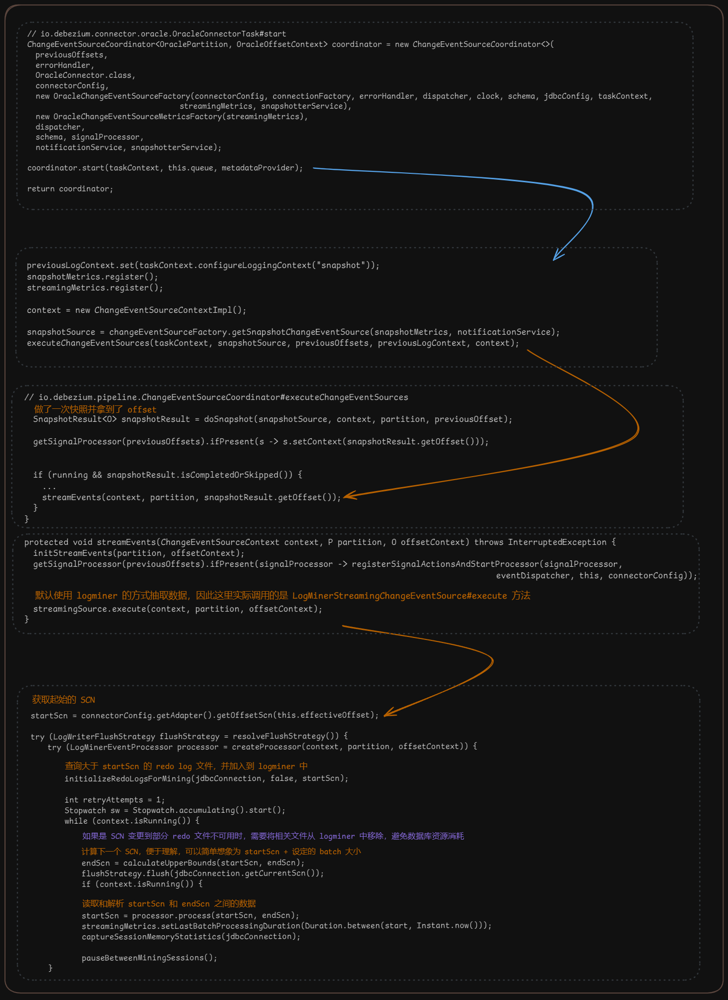

### 代码流程

源文件：[dbz-oracle-flow.excalidraw](/assets/excalidraw/dbz-oracle-flow.excalidraw)

### 参考文档

1. [Debezium 特性深入介绍 - 亚马逊AWS官方博客](https://aws.amazon.com/cn/blogs/china/debezium-deep-dive/)：讲到了 dbz 的快照机制，单机和分布式的工作模式，些微提及了水位线算法
2. [Flink oracle cdc - Oracle Logminer CDC性能问题_flink oracle cdc-CSDN博客](https://blog.csdn.net/qiuqiufangfang1314/article/details/129095438)：默认的 logminner 存在性能问题，每秒处理数据不超过 1w，这篇文章讲了通过异步转移日志到不影响业务的 Oracle 实例，然后并发解析 logminner 的方法已提升性能
3. [LogMiner详细讲解 - 三鹿专供 - 博客园](https://www.cnblogs.com/sanlu/p/6150327.html) logminer 的使用方法介绍，包括添加、删除日志文件等

