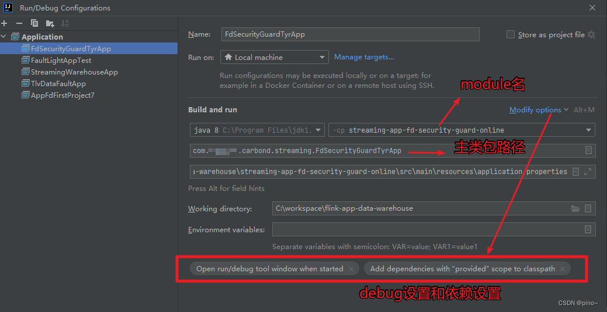

### Local 环境配置

```java
// 采用本地模式
StreamExecutionEnvironment env = StreamExecutionEnvironment.createLocalEnvironment();

// 调试完成后需要改为集群环境
// StreamExecutionEnvironment env = StreamExecutionEnvironment.getExecutionEnvironment();
```


### idea 配置



注意 maven 项目中有运行环境提供依赖，则需要设置 add dependencies with “provided” scope to calsspath，否则会报错NoClassDefFoundError

在 pom.xml 中需要引入 flink-clients 依赖（解决 No ExecutorFactory found to execute the application 问题）：

```xml
<dependency>
            <groupId>org.apache.flink</groupId>
            <artifactId>flink-clients_2.11</artifactId>
            <version>${flink.version}</version>
  </dependency>
```


---

1. [Flink本地Debug调试的方法和注意点_flink 本地调试-CSDN博客](https://blog.csdn.net/weixin_44883450/article/details/132882057)
2. [Flink 解决 No ExecutorFactory found to execute the application-腾讯云开发者社区-腾讯云](https://cloud.tencent.com/developer/article/1730029)

